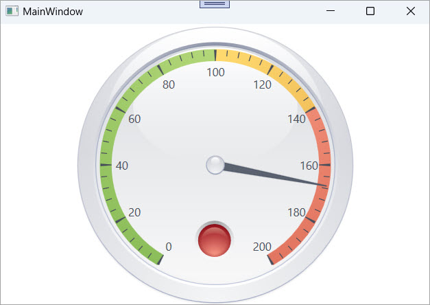

<!-- default badges list -->

[](https://supportcenter.devexpress.com/ticket/details/E3798)
[](https://docs.devexpress.com/GeneralInformation/403183)
[](#does-this-example-address-your-development-requirementsobjectives)
<!-- default badges end -->

# WPF Circular Gauge – Display a State Indicator Based on Value Ranges

This example connects a [`StateIndicatorControl`](https://docs.devexpress.com/WPF/DevExpress.Xpf.Gauges.StateIndicatorControl) to a [circular gauge needle](https://docs.devexpress.com/WPF/9957/controls-and-libraries/gauge-controls/visual-elements/circular-gauge/needle) and changes its visual state when the needle exceeds predefined value ranges.



Use the [StateIndicatorControl](https://docs.devexpress.com/WPF/DevExpress.Xpf.Gauges.StateIndicatorControl) when you need to:

* Change status colors (for example: green, yellow, red) based on the current value.
* Visualize thresholds or alerts.
* Synchronize a state indicator with a circular gauge.

## Implementation Details

### Configure Circular Gauge

The circular gauge defines a scale with three ranges:

```xaml
<dxga:ArcScale.Ranges>
    <dxga:ArcScaleRange StartValue="0" EndValue="100" />
    <dxga:ArcScaleRange StartValue="100" EndValue="140" />
    <dxga:ArcScaleRange StartValue="140" EndValue="200" />
</dxga:ArcScale.Ranges>
````

A needle is placed on the gauge and set to an initial value:

```xaml
<dxga:ArcScaleNeedle x:Name="needle" Value="40" IsInteractive="True" />
```

### Bind State Indicator 

The [`StateIndicatorControl`](https://docs.devexpress.com/WPF/DevExpress.Xpf.Gauges.StateIndicatorControl) is bound to the needle through the [`AnalogGaugeControl.ValueIndicator`](https://docs.devexpress.com/WPF/DevExpress.Xpf.Gauges.AnalogGaugeControl.ValueIndicator) attached property:

```xaml
<dxga:StateIndicatorControl
    dxga:AnalogGaugeControl.ValueIndicator="{Binding ElementName=needle}" />
```

The control defines multiple states for different value ranges:

```xaml
<dxga:StateIndicatorControl.AdditionalStates>
    <dxga:State>
        <dxga:State.Presentation>
            <dxga:LampGreenStatePresentation />
        </dxga:State.Presentation>
    </dxga:State>
    <dxga:State>
        <dxga:State.Presentation>
            <dxga:LampYellowStatePresentation />
        </dxga:State.Presentation>
    </dxga:State>
    <dxga:State>
        <dxga:State.Presentation>
            <dxga:LampRedStatePresentation />
        </dxga:State.Presentation>
    </dxga:State>
</dxga:StateIndicatorControl.AdditionalStates>
```

As the needle moves across a scale range, the state indicator updates its appearance to reflect the current state.

## Files to Review

* [MainWindow.xaml](./CS/WpfApplication1/MainWindow.xaml) (VB: [MainWindow.xaml](./VB/WpfApplication1/MainWindow.xaml))
* [MainWindow.xaml.cs](./CS/WpfApplication1/MainWindow.xaml.cs) (VB: [MainWindow.xaml.vb](./VB/WpfApplication1/MainWindow.xaml.vb))

## Documentation

* [Gauge Controls](https://docs.devexpress.com/WPF/115093/controls-and-libraries/gauge-controls)
* [Circular Gauge](https://docs.devexpress.com/WPF/9954/controls-and-libraries/gauge-controls/visual-elements/circular-gauge)
* [AnalogGaugeControl.ValueIndicator](https://docs.devexpress.com/WPF/DevExpress.Xpf.Gauges.AnalogGaugeControl.ValueIndicator)
* [StateIndicatorControl](https://docs.devexpress.com/WPF/DevExpress.Xpf.Gauges.StateIndicatorControl)
* [CircularGaugeControl](https://docs.devexpress.com/WPF/DevExpress.Xpf.Gauges.CircularGaugeControl)
* [Circular Gauge - Needle](https://docs.devexpress.com/WPF/9957/controls-and-libraries/gauge-controls/visual-elements/circular-gauge/needle)

## More Examples

* [WPF Gauges Getting Started – Lesson 3 – Create a Digital Gauge](https://github.com/DevExpress-Examples/wpf-gauges-getting-started-create-digital-gauge)
* [WPF Gauges – Set Width and Height of Symbols in Digital Gauge](https://github.com/DevExpress-Examples/wpf-gauges-set-width-and-height-of-symbols-in-digital-gauge-control)
* [WPF Gauge – Create a Digital Gauge](https://github.com/DevExpress-Examples/wpf-create-digital-gauge)
* [WPF Linear Gauge – Display Custom UI Elements](https://github.com/DevExpress-Examples/wpf-linear-gauge-display-custom-ui-elements)
* [Reporting for WPF – Advanced Gauge Customization](https://github.com/DevExpress-Examples/reporting-wpf-advanced-gauge-customization)
* [WPF Gauges – Create a Volume Knob](https://github.com/DevExpress-Examples/wpf-gauges-create-volume-knob)

<!-- feedback -->
## Does this example address your development requirements/objectives?

[](https://www.devexpress.com/support/examples/survey.xml?utm_source=github&utm_campaign=wpf-circular-gauge-display-state-indicator&~~~was_helpful=yes) [](https://www.devexpress.com/support/examples/survey.xml?utm_source=github&utm_campaign=wpf-circular-gauge-display-state-indicator&~~~was_helpful=no)

(you will be redirected to DevExpress.com to submit your response)
<!-- feedback end -->
